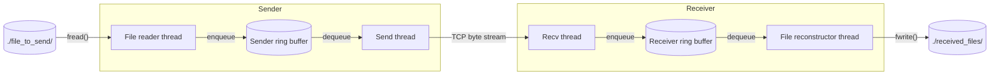

# A Multithreaded File-Transfer System in C

A multithreaded system for transferring files over TCP made in C. It decouples disk I/O and Network I/O using bounded ring buffers that handle backpressure. Producer-Consumer pipelines are used to separate subsystems cleanly.





### Problems the design has to solve

A naive file-transfer system using a looped send and receive cycle has multiple problems
    
1. Disk I/O and network I/O are coupled, the network sits idle while the disk reads, and the disk sits idle while the network sends. The time per chunk is disk time plus network time, where a pipeline should get it down to roughly the slower of the two.
    
2. Decoupling the stages with an unbounded queue only moves the problem. When one side is faster, the queue grows without limit and memory is exhausted. The system needs a bound that forces the fast side to wait.

3. TCP is a byte stream with no message boundaries. A single recv() can return half a header or several messages joined together, so the receiver needs a framing scheme to know where each message starts and ends.

4. Separation of concerns. A single loop mixes disk, network and framing logic in one place. Splitting them into subsystems with narrow interfaces makes each one testable and replaceable on its own.


### Approach 

The system is a four-stage pipeline split across two ends of a TCP connection.

On the sender, a file reader thread reads the file in chunks and wraps them into messages, and a send thread transmits them.

On the receiver, a recv thread reassembles messages from the byte stream, and a file reconstructor thread writes them to disk. 

Neighbouring stages never call each other directly. They meet only at a bounded ring buffer, which answers the problems above: disk and network work in parallel instead of taking turns, and memory use is capped. Each buffer is guarded by a lock and two condition variables. When a buffer is full, the producer sleeps until the consumer frees a slot, and when it is empty, the consumer sleeps until data arrives. Because a waiting thread sleeps rather than polls, it uses no CPU, and a buffer can neither overflow nor underflow. 

Ownership of each heap-allocated message passes from producer to consumer through the buffer, so the consumer frees what the producer allocated. 

To get message boundaries out of the byte stream, every message starts with a fixed-size header holding the message type (FILE_START_MSG, FILE_DATA_MSG or FILE_END_MSG) and a payload length that counts the bytes after the header. The receiver reads the full header, then loops until it has exactly that many payload bytes, which makes partial recv() calls harmless. 

See docs/ARCHITECTURE.md for the full design.


### How backpressure propagates

Backpressure is not local to one buffer. It travels from the receiver's disk back to the sender's file reader. A slow disk makes the file reconstructor dequeue more slowly, so the receiver's buffer fills and the recv thread blocks in enqueue and stops calling recv(). The receiver's TCP window then fills, and the sender's send() blocks. That fills the sender's buffer and finally stalls the file reader. Nothing is dropped and memory never grows without bound.

reconstructor slows → receiver buffer full → recv blocks → TCP window full → send blocks → sender buffer full → file reader blocks


### Design decisions and trade-offs

**32 slots, 4 KB chunks.** These are reasonable defaults, not tuned values. The chunk size means
a file never has to fit in memory or in the buffer: it streams through in pieces, so file size and
memory use are independent. The slot count only bounds how far the fast side can run ahead
(32 × 4 KB = 128 KB in flight per buffer). I haven't benchmarked other values yet.

**One blocking thread per stage.** I chose this to keep the subsystems cleanly separated and to
learn how they interact, not because it is the most scalable design. The cost is more threads
and more context switches than an event loop (`select`, IOCP) would use. For one
connection and one file that cost is negligible. It would matter with many concurrent
transfers, and an event-driven design would be the better fit there.

**Mutex and two condition variables.** The ring buffer needs to be safe
under concurrent access and to block producers and consumers instead of failing or spinning.
A lock with `not_full` and `not_empty` condition variables does that simply and correctly.

**Length-prefixed framing.** Every message carries its payload length in a fixed-size header.
I took this from a packet sniffer I wrote earlier, where I wrote parsers for several EtherTypes
and followed the same principle: read the fixed header, learn the length, read exactly that
many bytes. It is simple, it handles binary payloads without escaping, and the receiver always
knows how much to read. Delimiter-based framing would need escaping, because file data can contain any byte.

**What the bound does not give you.** Bounding the buffers caps memory and propagates
backpressure, but it does not propagate failure. If one side dies, the other side's threads
can still block forever on a full or empty buffer. This is why clean shutdown is the top
priority in the roadmap.


### Benchmarks

#### Disk I/O pipeline (`tests/disk_io_bench.c`)

This benchmark isolates the disk side of the system. It runs the file reader thread and the
file reconstructor over a single ring buffer, with no network involved. The reader takes the
first file in ./file_to_send/, so bench.bin must be the only file there (delete the dummy
file first). The reconstructor writes ./received_files/bench.bin, which is the name the final
size check looks for. The timer wraps the reconstructor loop, from the first dequeue to the
FIN message, and throughput is `file size / elapsed time` in decimal MB/s (1 MB = 1,000,000
bytes). The test then compares the sent and received sizes and prints `PASS` or `FAIL`.

Because the reader and reconstructor run concurrently, the result is limited by the slower
stage. In practice that is the reconstructor, which is reopening the output file for every
chunk.

**Setup:** 268,435,456-byte (256 MiB) `.bin` file, 4 KB chunks, 32-slot ring buffer, 
Intel i5-11400F, Toshiba HDWD110 SATA HDD, Windows 11.

To create a zero-filled file of 256 MiB:
```powershell
fsutil file createnew file_to_send\bench.bin 268435456
```

| Version | Output file handling | Throughput (MB/s) |
|---|---|---|
| Baseline | `fopen`/`fclose` per 4 KB chunk | 22–27 typical, 19.6 worst run |
| After fix | Work in progress | Work in progress |

**Results:**
Opening the file again and again with `fopen()` called for every chunk, throughput ranged from 19.6 to 27 MB/s across repeated runs.

**Caveats:** this measures the disk pipeline only, not the network. Numbers vary between
runs because of OS file caching, and I did not control for it.


### Systems concepts covered
- Producer-consumer pipelines.
- Bounded ring buffer with lock and condition variables. (blocking, not polling)
- End-to-end backpressure through TCP flow control.
- Message framing over a byte stream, including partial recv() handling.
- Ownership transfer of heap messages between threads.
- Thread lifecycle and shutdown via an END message.


### Build and run

Requirements: Windows, MinGW-w64 (GCC), CMake.

```powershell
cmake --preset "GCC 15.1.0 x86_64-w64-mingw32"
cmake --build --preset "GCC 15.1.0 x86_64-w64-mingw32"
```

The build produces a single executable, file_transfer, which acts as either end of the transfer. It is chosen at runtime from a menu. Run it from the project root, because the ./file_to_send/ and ./received_files/ paths are relative.

**First-time setup:** `file_to_send/` and `received_files/` each contain a small dummy file,
because git doesn't track empty directories and they wouldn't exist after cloning otherwise.
Delete the dummy files after you clone, then run your own test.

Receiving: start the program, choose 2, and optionally enter a bind address (default 127.0.0.1). It listens on port 27015 and waits for a sender.

Sending: put the file you want to send in ./file_to_send/, start the program, and choose 1.
The program shows the name of the first file it finds and asks `Continue to send? [y/n]`.
Enter `y` to continue, then enter the receiver's IP and port. Only one file is sent per run,
so keep a single file in ./file_to_send/. The received file appears in ./received_files/.


# Project layout

| Folder              | Purpose                                                                                                                    |
|---------------------|----------------------------------------------------------------------------------------------------------------------------|
| ring_buffer/        | The bounded producer-consumer buffer. One instance on the sender side and one on the receiver side.                        |
| transport/          | Framing, sending and receiving of messages, plus connection handling                                                       |
| file_reader/        | Reads the file, frames it into messages and enqueues them on the sender's ring buffer.                                     |
| file_reconstructor/ | Dequeues from the receiver's ring buffer and rebuilds the file with fwrite() according to each message type.               |
| error_handling/     | Minimal error reporting: names the failing module and a WSAGetLastError() where it applies.                                |
| tests/              | Small per-subsystem test programs plus an end-to-end sender and receiver pair, written to exercise each part in isolation. |


## Status

Work in progress. The core pipeline works end to end: a file moves from disk to the
sender's ring buffer, over TCP, through the receiver's ring buffer, and back onto disk, with
backpressure propagating across the whole chain. I'm now hardening shutdown and error
handling, and the transport layer. The issues below are known, and I'd rather list them than
hide them.

### Known issues

**Shutdown and error handling** (top priority)
- If one side disconnects or fails mid-transfer, the other side's threads can block forever
  on an empty or full ring buffer, so the process may not exit. There is no cancellation path
  that wakes blocked threads.
- A thread that hits an error does not reliably signal the others, so they can keep running
  against state `main` is already tearing down.
- Completion flags (`FIN`) are not initialized in `main` and are not atomic.

**Memory management**
- Ring buffer synchronization objects are not destroyed on exit.

**Transport**
- `send()` is not looped, so a partial send is not handled. The receive side handles partial
  reads correctly.
- The header is sent in host byte order with no explicit packing.
- The START message length is not validated against its struct size, and the received
  filename is not sanitized. **Do not use this on untrusted networks.**

**Limits**
- Files over 2 GB are not supported (32-bit `long` on Windows).
- No integrity check: the receiver does not verify the final size or a checksum.
- The receiver reopens the output file for every 4 KB chunk. This is simple but slow.
- Windows only (Winsock2 and Win32 threads), one file per run, IPv4 addresses only.

### Roadmap
- [ ] Clean shutdown: a shared cancellation flag plus waking blocked threads, so any failure
      exits both ends cleanly
- [x] Audit and fix every allocation and free path, then verify with a leak checker
- [ ] Add ring_buffer_destroy and call it on both ends at shutdown
- [ ] Loop `send()` until all bytes are sent
- [ ] Fixed-width, packed, network-byte-order header with bounds checks and filename sanitizing
- [ ] SHA-256 checksum verified by the receiver
- [ ] Keep the output file open for the whole transfer
- [ ] Benchmarks: pipelined vs. naive loop, and the effect of buffer size and chunk size
- [ ] Multiple files per session, then resume after a dropped connection
- [ ] Portable build (POSIX sockets and pthreads) so it runs on Linux
- [ ] Optional TLS