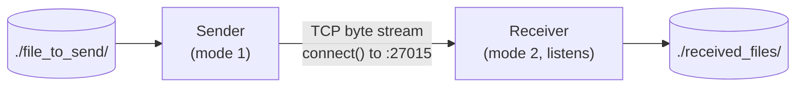
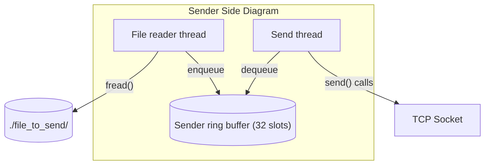
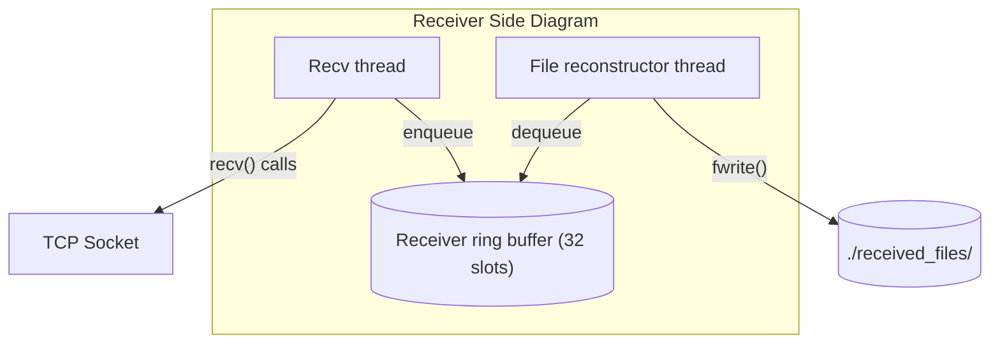
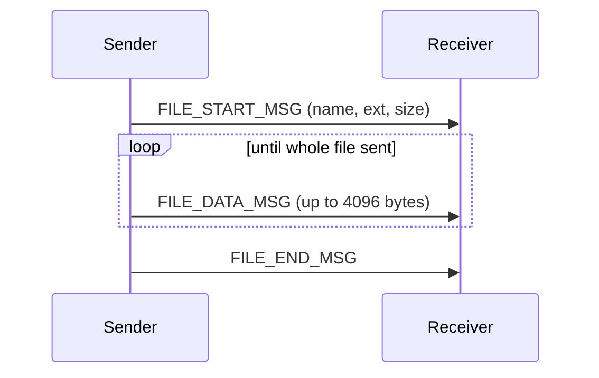

#  A Multithreaded File-Transfer System in C

A multithreaded file-transfer system over TCP, written in C on Winsock2, utilizing producer-consumer pipelines and a bounded ring buffer which handles backpressure.

Core Idea: A single executable that behaves as either end-point and allows files to transfer over TCP while keeping disk I/O separate from network I/O.

Scope: Single file per transfer, Single sender and receiver, No encryption, No pause or resume.

(This document describes the intended design. See the README's Known Issues for where the current code differs.)

### Sender Side
Arrows show which thread calls into which component.

### Receiver Side
Arrows show which thread calls into which component.

### Threads and responsibilities

1. File reader thread:
    
    It reads file in 4KB chunks and wraps them into messages, in order: start, data x N, end. 

    Blocks when ring buffer is full since enqueue waits.

    Allocates each message with malloc and passes pointer into ring buffer.

    Exits once file_end_msg is enqueued, or if enqueue reports that the send thread failed (READER_CNSMR_FAILURE).

2. Send thread:

    It dequeues messages from the ring buffer and sends each one over the TCP socket, header followed by payload.

    Blocks when ring buffer is empty since dequeue waits. Also blocks in send() when the TCP window is full.

    Takes ownership of each message pointer on dequeue and is responsible for freeing it after sending.

    Exits once file_end_msg is sent, or if send() fails. If send() fails it flags consumer failure so the file
    reader stops. It also exits if the file reader failed (DEQUEUE_PRDCR_FAIL).

3. Recv thread:

    It reads the fixed-size message header first, loops until all header bytes arrive, then reads payload_length
    bytes of payload. Since TCP is a byte stream, one recv() call can return less than requested.

    Blocks in recv() when no data has arrived. Also blocks when ring buffer is full since enqueue waits. This
    is where backpressure reaches the network.

    Allocates each received message with malloc and passes pointer into ring buffer.

    Exits once file_end_msg is received, or if the connection drops or a message is invalid (producer failure),
    or if the reconstructor failed (RECV_CNSMR_FAILURE).

4. File reconstructor thread:

    It dequeues messages and rebuilds the file on disk. On file_start_msg it creates file from the filename and
    extension, on each file_data_msg it appends the payload, on file_end_msg it stops.

    Blocks when ring buffer is empty since dequeue waits.

    Takes ownership of each message pointer on dequeue and is responsible for freeing it after use.

    Exits once file_end_msg is processed. If reconstruction fails, it flags consumer failure so the recv thread
    stops. It also exits if the recv thread failed.

### Why split disk and network I/O

I split the system into separate threads because I wanted a cleanly separated, modular design instead of a script that does everything in one loop. It was also good practice for systems engineering, and it exposed me to problems that real systems run into.

The practical benefit is that disk and network work independently. The threads never talk to each other directly. They only meet at the ring buffer, so a slow disk does not stall the socket, and a slow network does not stall the file reader.

### Backpressure

Backpressure is an inevitable problem with a TCP stream. Producers and consumers never run at exactly the same speed, so the system needs a way to slow the faster side down instead of letting it run ahead.

The ring buffer is bounded at 32 slots. When it is full, the producer blocks until the consumer makes room. When it is empty, the consumer blocks until the producer adds something. I implemented this with condition variables and blocking waits instead of polling, so a waiting thread sleeps and uses no CPU, then wakes only when the state it needs has changed.

On the receiver, the effect travels all the way back to the sender. A slow disk makes the reconstructor dequeue more slowly, the buffer fills, `recv_thread` blocks in `enqueue` and stops calling `recv()`, the receiver's TCP window fills, and the sender's `send()` blocks. That in turn fills the sender's ring buffer and throttles the file reader. Nothing is dropped and nothing grows without limit.

### Failure propagation through the ring buffer

The ring buffer carries two flags, `producer_failure` and `consumer_failure`. Both are set under the lock, and setting either wakes every thread waiting on `not_empty` and `not_full`. Waiters re-check the flag after waking, so a blocked thread cannot sleep through a failure.

| Event | Who signals | Effect on the other side |
|---|---|---|
| Consumer fails (`send()` or disk write error) | `ring_buffer_consumer_failure()` | `enqueue()` returns `ENQUEUE_CNSMR_FAIL`, immediately, even on a full queue. The producer returns a status such as `READER_CNSMR_FAILURE` or `RECV_CNSMR_FAILURE`. |
| Producer fails (read error, connection lost, bad message) | `ring_buffer_producer_failure()` | `dequeue()` still returns queued messages, then `DEQUEUE_PRDCR_FAIL` when empty. |

Once the consumer has failed, nothing else can be enqueued, so the queue stops at that moment. Producers use distinct statuses (`READER_OK`/`READER_FAILURE`/`READER_CNSMR_FAILURE`, and the `RECV_` equivalents). A thread wrapper can then tell its own failure from a forced stop. Only an own failure raises `ring_buffer_producer_failure()`, because after a consumer failure nobody is left to notify.

**Ownership on failure.** When `enqueue()` returns `ENQUEUE_CNSMR_FAIL`, the message was not stored and the caller still owns it. It must free it, along with its own resources.

**Limit.** This covers failures that happen inside one process's pipeline. A thread blocked in `recv()` is not woken by the ring buffer.

### Data flow of one transfer

### Message types
1.  START 
    
    Carries filename, extension and file size. The receiver creates the file in ./received_files/.

2. DATA

    Up to 4096 payload bytes each, and the last one is usually smaller. The receiver appends each one to the file.

3. END

    No payload (payload_length = 0). It tells the receiver to stop, and the receiver's threads shut down.

### Message framing
Every message starts with a small header holding msg_type and payload_length. The receiver reads the header first, then reads exactly payload_length more bytes. This is why it works on a byte stream where message boundaries don't exist.